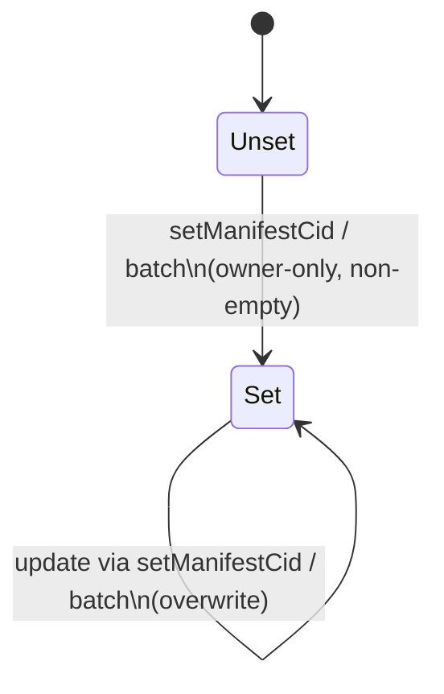

## DidManifestRegistry — Function Overview (Contract + Tests)

- **Contract**: `identity/contracts/contracts/DidManifestRegistry.sol`
- **Test suite**: `identity/contracts/test/DidManifestRegistry.test.ts`
- **Solidity**: `^0.8.20`
- **Access control**: OpenZeppelin `Ownable` (owner-only writes)
- **Purpose**: Public on-chain registry that maps a **DID key** (\(bytes32\)) to an **IPFS manifest CID** (\(string\)).

---

## Scope (what to review in this contract)

This document is a **function-by-function reference** for audit work: signatures, access control, inputs/outputs, state writes, events, and revert conditions, plus what the unit tests assert.

The on-chain data model is:

- `didKey (bytes32)` → `manifestCid (string)`

Where `didKey` is expected to be computed off-chain as `keccak256(utf8(didUri))`.

---

## Typical usage (call flow)

```mermaid
flowchart LR
  Issuer[Issuer Backend / Ops Wallet\n(Owner)] -->|setManifestCid / setManifestCidsBatch| Chain[(Rootstock / EVM)]
  Chain -->|getManifestCid (view)| Client[Wallet / Citizen App / Verifier]
  Client -->|HTTP GET| IPFS[(IPFS Gateway)]
  IPFS --> Manifest[Manifest JSON\n(contains credential CIDs, metadata, etc.)]
```

---

## Data model

### Storage

- `manifestCidByDidKey: mapping(bytes32 => string)` (private)
  - Key: `didKey` (expected: `keccak256(utf8(didUri))`)
  - Value: `manifestCid` (string; must be non-empty on writes)

### Event

- `ManifestCidSet(bytes32 indexed didKey, string manifestCid, address indexed writer)`
  - Emitted on every successful write (single or batch).
  - Intended for off-chain indexers to track updates per DID key.

---

## Function summary table

| Function | Visibility | Modifiers | State writes | Emits | Reverts (directly in this contract) |
|---|---:|---|---:|---:|---|
| `constructor()` | - | - | ✅ | ❌ | - |
| `setManifestCid(bytes32 didKey, string manifestCid)` | external | `onlyOwner` | ✅ | ✅ | if `manifestCid` empty |
| `setManifestCidsBatch(bytes32[] didKeys, string[] manifestCids)` | external | `onlyOwner` | ✅ | ✅ | if array length mismatch; if any CID empty |
| `getManifestCid(bytes32 didKey) returns (string)` | external view | - | ❌ | ❌ | - |

Additionally (inherited from OpenZeppelin `Ownable`):

| Function (inherited) | Modifiers | Notes |
|---|---|---|
| `owner() returns (address)` | view | returns current owner |
| `transferOwnership(address newOwner)` | `onlyOwner` | changes write authority |
| `renounceOwnership()` | `onlyOwner` | permanently removes write authority |

---

## Function-by-function behavior

### `constructor()`

- **Location**: `constructor() Ownable(msg.sender) {}`
- **Effects**: sets the initial owner to the deployer (`msg.sender`) via `Ownable`.
- **Writes**: owner slot (in `Ownable`)
- **Events**: none in this contract

### `setManifestCid(bytes32 didKey, string manifestCid)`

- **Access**: `onlyOwner`
- **Inputs**:
  - `didKey`: bytes32 key (expected derived from DID URI off-chain)
  - `manifestCid`: IPFS CID string
- **Validation / revert conditions (this contract)**:
  - reverts if `bytes(manifestCid).length == 0` with `"DidManifestRegistry: manifestCid cannot be empty"`
- **Effects**:
  - `manifestCidByDidKey[didKey] = manifestCid` (overwrites any previous value)
- **Emits**:
  - `ManifestCidSet(didKey, manifestCid, msg.sender)`
- **Notes**:
  - No CID format validation is performed (the string is treated as opaque bytes).

### `getManifestCid(bytes32 didKey) returns (string)`

- **Access**: public read (no modifier)
- **Inputs**:
  - `didKey`: bytes32 key
- **Effects**: none (view)
- **Returns**:
  - the stored CID string for `didKey`, or `""` if never set

### `setManifestCidsBatch(bytes32[] didKeys, string[] manifestCids)`

- **Access**: `onlyOwner`
- **Inputs**:
  - `didKeys`: array of bytes32 keys
  - `manifestCids`: array of CID strings, aligned by index
- **Validation / revert conditions (this contract)**:
  - reverts if `didKeys.length != manifestCids.length` with `"DidManifestRegistry: arrays length mismatch"`
  - reverts if any `manifestCids[i]` is empty with `"DidManifestRegistry: manifestCid cannot be empty"`
- **Effects**:
  - for each index `i`:
    - `manifestCidByDidKey[didKeys[i]] = manifestCids[i]` (overwrites any previous value)
- **Emits**:
  - for each index `i`:
    - `ManifestCidSet(didKeys[i], manifestCids[i], msg.sender)`
- **Notes**:
  - Entire call is atomic: if any element fails validation, all state changes revert.

### Inherited ownership management (`Ownable`)

These functions are not defined in `DidManifestRegistry.sol` but exist due to inheritance and are operationally relevant:

- `owner()`: returns current owner address
- `transferOwnership(newOwner)`: changes the authorized writer
- `renounceOwnership()`: removes the authorized writer (future `onlyOwner` calls become impossible)

---

## State model (per DID key)



---

## Unit tests (what is asserted)

File: `identity/contracts/test/DidManifestRegistry.test.ts`

### Deployment

- Asserts deployer address equals `owner()`.

### `setManifestCid`

- Owner can set CID and `ManifestCidSet` is emitted with `(didKey, cid, owner)`.
- Empty CID reverts with `"DidManifestRegistry: manifestCid cannot be empty"`.
- Non-owner call reverts with `OwnableUnauthorizedAccount`.
- Setting again overwrites the existing CID.

### `getManifestCid`

- Returns `""` for an unset `didKey`.
- Returns the correct CID after it has been set.
- Is callable by non-owner accounts.

### `setManifestCidsBatch`

- Owner can set two keys in one call and both are retrievable.
- Mismatched array lengths revert with `"DidManifestRegistry: arrays length mismatch"`.
- Empty CID in batch reverts with `"DidManifestRegistry: manifestCid cannot be empty"`.

---

## Reference: DID key derivation (as used in tests)

```ts
const didKey = ethers.keccak256(ethers.toUtf8Bytes("did:test:123"));
```

All readers/writers must use the **same derivation** to guarantee consistent lookups.

