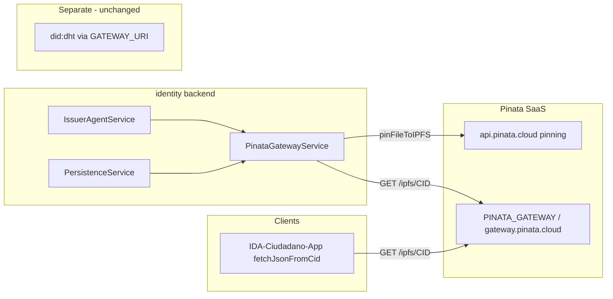
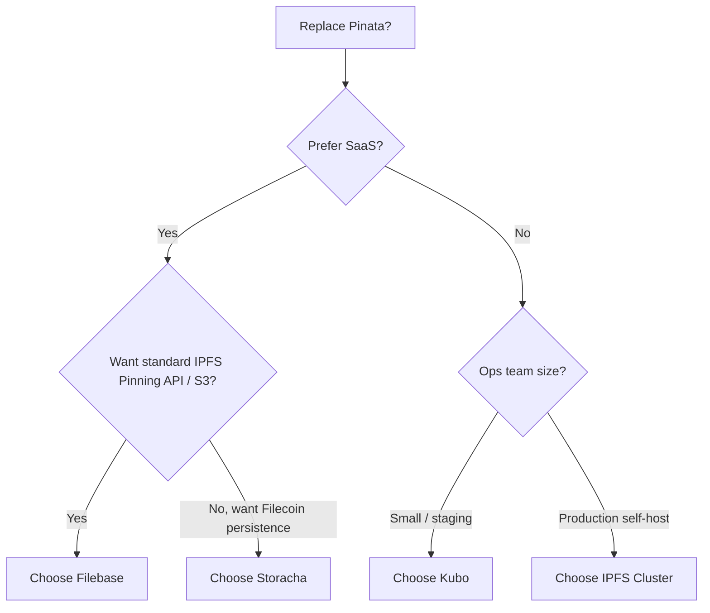

# IPFS Pinata Replacement Options — Evaluation Report

**Purpose:** Compare viable alternatives to Pinata for the SSI stack’s encrypted credential and manifest storage on IPFS.

**Audience:** Architects and engineers operating `identity/`, `IDA-Ciudadano-App/`, and related deployments.

**Date:** May 2026

**Scope:** Four options — **2 paid (well-known SaaS)** and **2 self-hosted** — mapped to the current `IpfsGateway` integration.

---

## 1. Executive summary

| #   | Deliverable                         | Status        | Highlights                                                                                                      |
| --- | ----------------------------------- | ------------- | --------------------------------------------------------------------------------------------------------------- |
| —   | Current IPFS provider               | **Pinata**    | [pinata.cloud](https://pinata.cloud); sandbox default via `pinataGateway.service.ts`.                           |
| 1   | Backend integration                 | Implemented   | `IpfsGateway` in `identity/src/ipfs/ipfs.interface.ts`; upload/read/unpin via Pinata REST + gateway JWT.        |
| 2   | Upload path                         | Pinata API    | `POST https://api.pinata.cloud/pinning/pinFileToIPFS` → `IpfsHash` (CID).                                       |
| 3   | Read path                           | Pinata gateway | `GET ${PINATA_GATEWAY}/ipfs/{cid}`; mobile uses `EXPO_PUBLIC_IPFS_GATEWAY_BASE_URL`.                           |
| 4   | Delete / lifecycle                  | Implemented   | `DELETE https://api.pinata.cloud/pinning/unpin/{cid}` via `unpinCid`.                                          |
| 5   | Identity layer (unchanged)          | `did:dht`     | `GATEWAY_URI` / `@web5/dids` — separate from IPFS credential storage; not affected by provider migration.     |
| 6   | Portability                         | CIDs portable | Pins and gateway URLs are provider-specific; migration needs re-pinning or dual-run during cutover (see §7–8). |

### Options at a glance

| #   | Deliverable   | Status                    | Highlights                                                                                                      |
| --- | ------------- | ------------------------- | --------------------------------------------------------------------------------------------------------------- |
| 1   | Filebase      | Paid SaaS (**recommended**) | S3-familiar APIs, official IPFS Pinning Service API, dedicated gateways; medium migration effort.              |
| 2   | Storacha      | Paid SaaS                 | Managed pinning + Filecoin-backed persistence; medium–high migration; verify `unpinCid` semantics.              |
| 3   | Kubo          | Self-hosted               | Single-node control; `KuboCompatibleGateway` in repo (untested); low–medium code effort, high ops.             |
| 4   | IPFS Cluster  | Self-hosted (production)  | HA pinning across multiple peers; new adapter required; best long-term self-hosted option.                     |
| 5   | Pinata        | Paid SaaS (current)       | Proven in this repo; stay until cost, residency, or SLA drivers justify migration.                             |

---

## 2. Current architecture (baseline)



**Stored on IPFS today (via Pinata):**

- Encrypted credential JWTs
- Credential manifests
- Portable issuer DID backup (CID referenced in env/docs)

**Security note:** Credentials are encrypted before upload; the pinning provider sees ciphertext, not plaintext VC content.

---

## 3. Evaluation criteria (SSI / IDA context)

| Criterion | Weight | Notes |
|-----------|--------|-------|
| **Pinning reliability** | High | Holders must resolve CIDs months/years later |
| **HTTP gateway** | High | Apps use gateway URLs, not libp2p directly |
| **Delete / unpin** | Medium | `unpinCid` used for lifecycle; GDPR-style requests |
| **Migration effort** | High | Fit to existing `IpfsGateway` + env vars |
| **Ops burden** | Medium | Self-hosted = you run nodes, TLS, backups |
| **Cost predictability** | Medium | Egress + storage + dedicated gateway fees |
| **Vendor neutrality** | Medium | Standard [IPFS Pinning Service API](https://ipfs.github.io/pinning-services-api-spec/) vs proprietary REST |
| **Compliance / residency** | Context-dependent | Self-hosted or EU-region SaaS if required |

---

## 4. Paid options (well-known SaaS)

### 4.1 Filebase

| Attribute | Detail |
|-----------|--------|
| **Website** | https://filebase.com |
| **Category** | Managed IPFS pinning + S3-compatible API + dedicated gateways |
| **Industry standing** | Listed in [official IPFS docs](https://docs.ipfs.tech/how-to/work-with-pinning-services/) as supporting the **IPFS Pinning Service API** (alongside Pinata) |
| **Strengths** | S3-compatible workflows; multi-network backends; dedicated gateways on paid tiers; interoperable with `ipfs pin remote` |
| **Weaknesses** | Different API than Pinata — requires new `IpfsGateway` implementation or adapter |
| **Typical pricing** | Free tier (~5 GB); paid tiers scale by storage/bandwidth (verify current pricing on vendor site) |

**Fit for this codebase:**

| Operation | Pinata today | Filebase approach |
|-----------|--------------|-------------------|
| Upload + pin | `pinFileToIPFS` | S3 `PutObject` with IPFS metadata, or Pinning Service API `POST /pins` |
| Read | `GET {gateway}/ipfs/{cid}` | Dedicated Filebase gateway URL |
| Unpin | `pinning/unpin/{cid}` | Pinning Service API `DELETE /pins/{id}` or S3/object lifecycle |

**Migration effort:** **Medium** — new service class (e.g. `FilebaseGatewayService`), new env vars (`FILEBASE_ACCESS_KEY`, `FILEBASE_SECRET_KEY`, `FILEBASE_GATEWAY_URL`), update mobile `EXPO_PUBLIC_IPFS_GATEWAY_BASE_URL`.

**Best for:** Teams wanting a mature SaaS with standard IPFS APIs and S3 ergonomics without running nodes.

---

### 4.2 Storacha (formerly Web3.Storage)

| Attribute | Detail |
|-----------|--------|
| **Website** | https://storacha.network |
| **Category** | Managed uploads + IPFS pinning + Filecoin persistence (Protocol Labs ecosystem) |
| **Industry standing** | Successor to **web3.storage**; widely used in Web3 for content-addressed storage |
| **Strengths** | Strong persistence story (Filecoin deals); dev-friendly; credible for long-lived credentials |
| **Weaknesses** | API model differs from Pinata; product evolution — validate current SDK/HTTP surface before committing |
| **Typical pricing** | Free tier; paid plans by storage (verify on storacha.network) |

**Fit for this codebase:**

| Operation | Pinata today | Storacha approach |
|-----------|--------------|-------------------|
| Upload + pin | Multipart to Pinata API | Storacha client upload → returns CID |
| Read | Pinata gateway | Public or Storacha-associated gateway (configure per deployment) |
| Unpin | Pinata unpin | Check Storacha deletion/space management semantics (may differ) |

**Migration effort:** **Medium–High** — new adapter, possible SDK dependency (`@storacha/client` or equivalent), revisit `unpinCid` behavior for compliance.

**Best for:** Long-term archival of encrypted blobs where Filecoin-backed durability matters and managed ops are preferred over self-hosting.

---

### 4.3 Paid options — side-by-side

| | **Filebase** | **Storacha** | **Pinata (current)** |
|---|-------------|--------------|----------------------|
| **Recognition** | IPFS docs + enterprise S3 users | Protocol Labs lineage | De facto Pinata standard |
| **API style** | S3 + Pinning Service API | Storacha / UCAN-style uploads | Proprietary REST + JWT |
| **Persistence** | IPFS pin (+ vendor infra) | IPFS + Filecoin | IPFS pin on Pinata nodes |
| **Dedicated gateway** | Yes (paid) | Configurable | Yes (`*.mypinata.cloud`) |
| **Migration from Pinata** | Medium | Medium–High | — |
| **SSI fit** | Strong general-purpose | Strong if longevity > simplicity | Proven in this repo |

---

## 5. Self-hosted options

### 5.1 Kubo (single-node IPFS)

| Attribute | Detail |
|-----------|--------|
| **Project** | https://github.com/ipfs/kubo (formerly go-ipfs) |
| **Category** | Single IPFS node — API server + optional HTTP gateway |
| **Codebase status** | `KuboCompatibleGateway` exists; marked **not tested** (`TODO clase NO probada`) |
| **Strengths** | Full control; no per-GB SaaS bill; direct map to existing sketch (`/add`, `/cat`, `/pin/add`, `/pin/rm`) |
| **Weaknesses** | Single point of failure; disk, backups, security patches, gateway TLS on you; node must stay online for pins to matter |

**Fit for this codebase:**

| `IpfsGateway` method | Kubo API (via `IPFS_GATEWAY_URL`) |
|----------------------|-----------------------------------|
| `uploadContent` | `POST /api/v0/add` (pin=true by default) |
| `getContent` | `GET /api/v0/cat?arg={cid}` |
| `unpinCid` | `POST /api/v0/pin/rm?arg={cid}` |

**Deployment sketch:**

- Run Kubo on same VPC as `identity` EC2 or dedicated small instance
- Expose API on private network only; public reads via reverse-proxy to `/ipfs/{cid}`
- Set `IPFS_GATEWAY_URL` to internal API base (e.g. `http://127.0.0.1:5001/api/v0`)

**Migration effort:** **Low–Medium** (code exists) + **High ops** (you operate the node).

**Best for:** Dev/staging, pilots, or regulated environments where data must not leave your infrastructure.

---

### 5.2 IPFS Cluster

| Attribute | Detail |
|-----------|--------|
| **Project** | https://ipfscluster.io |
| **Category** | Orchestrates pinning across multiple Kubo peers |
| **Strengths** | HA pinning, replication, REST API, production pattern for “our own Pinata” |
| **Weaknesses** | Highest ops complexity (3+ peers recommended, monitoring, upgrades) |

**Fit for this codebase:**

| `IpfsGateway` method | IPFS Cluster approach |
|----------------------|------------------------|
| `uploadContent` | Cluster REST `POST /add` or pin after add |
| `getContent` | Any cluster peer gateway or dedicated read gateway |
| `unpinCid` | Cluster `DELETE /pins/{cid}` |

**Migration effort:** **High** (new infrastructure + new gateway adapter) + **best reliability** among self-hosted choices.

**Best for:** Production self-hosted equivalent to Pinata — government or enterprise SSI where SaaS is unacceptable.

---

### 5.3 Self-hosted — side-by-side

| | **Kubo (single node)** | **IPFS Cluster** |
|---|------------------------|------------------|
| **Availability** | Single node | Multi-node replication |
| **Ops complexity** | Lower | Higher |
| **Code readiness in repo** | Partial (`KuboCompatibleGateway`) | None — new adapter |
| **Cost** | EC2 + disk | Multiple nodes + disk |
| **SSI production fit** | Staging / small prod | Recommended self-hosted prod |

---

## 6. Comparison matrix (all four vs Pinata)

| Criterion | Pinata (current) | Filebase | Storacha | Kubo | IPFS Cluster |
|-----------|------------------|----------|----------|------|--------------|
| **Managed ops** | Yes | Yes | Yes | No | No |
| **HA by default** | Yes (vendor) | Yes (vendor) | Yes (vendor) | No | Yes (if sized) |
| **API match to current code** | Native | New adapter | New adapter | Partial | New adapter |
| **Standard Pinning Service API** | Partial / proprietary | Yes | Varies | N/A (Kubo API) | Cluster API |
| **Filecoin persistence** | No | Optional paths | Yes (core story) | Manual | Manual |
| **Dedicated gateway** | Yes | Yes | Configurable | You build | You build |
| **Unpin / delete** | Implemented | Supported | Verify semantics | `/pin/rm` | Cluster pin delete |
| **Mobile app change** | — | New gateway URL | New gateway URL | Your gateway URL | Your gateway URL |

---

## 7. Migration impact on this repository

### 7.1 Files to touch (any non-Pinata provider)

| Area | Path / config |
|------|----------------|
| Gateway implementation | `identity/src/ipfs/*.service.ts` |
| Module wiring | `identity/src/ipfs/ipfs.module.ts` (dynamic `IPFS_PROVIDER` commented in `app.module.ts`) |
| Consumers | `issuerAgent.service.ts`, `persistence.service.ts`, `ipfs.controller.ts` |
| Tests | `pinataGateway.service.spec.ts` → provider-specific or shared contract tests |
| Backend env | Replace `PINATA_JWT_TOKEN`, `PINATA_GATEWAY` |
| Mobile | `IDA-Ciudadano-App/.env.example`, `eas.json`, `app.json`, `services/ipfs.ts` |
| Docs / runbooks | `docs/SSI-System-Architecture.md`, Firebase/SSM secret names (`BACKEND_PINATA_JWT_TOKEN`) |
| Existing CIDs | Re-pin or dual-pin during transition; update DB DID↔CID only if CIDs change (they should not if content is identical) |

### 7.2 `IpfsGateway` contract (unchanged)

```typescript
export interface IpfsGateway {
  uploadContent(content: string, name?: string): Promise<string>;
  getContent(cid: string): Promise<string | object>;
  pinCid?(Cid: string): Promise<string>;
  unpinCid(Cid: string): Promise<string>;
}
```

Any replacement should implement this interface so SSI logic stays provider-agnostic.

### 7.3 Suggested env variable mapping

| Pinata (current) | Filebase | Storacha | Kubo / Cluster |
|------------------|----------|----------|----------------|
| `PINATA_JWT_TOKEN` | `FILEBASE_ACCESS_KEY` + secret | `STORACHA_TOKEN` / UCAN | N/A or API token |
| `PINATA_GATEWAY` | `FILEBASE_GATEWAY_URL` | `STORACHA_GATEWAY_URL` | `IPFS_GATEWAY_URL` (read) + `IPFS_API_URL` (write) |
| `IPFS_PROVIDER=pinata` | `filebase` | `storacha` | `kubo` / `cluster` |

---

## 8. Migration playbook (high level)

1. **Inventory** — List production CIDs (manifest, credentials, `ISSUER_PORTABLE_DID_CID`).
2. **Implement** — New `IpfsGateway` + feature flag `IPFS_PROVIDER`.
3. **Dual-write (optional)** — Pin to new provider while reads still hit Pinata.
4. **Backfill** — Re-pin existing CIDs on new provider (content-identical → same CID).
5. **Cutover reads** — Update `EXPO_PUBLIC_IPFS_GATEWAY_BASE_URL` and gateway env equivalents.
6. **Validate** — Issuance, holder fetch, manifest resolution (see `docs/identity/VALIDATION_COMPLETE.md` patterns).
7. **Decommission** — Unpin from Pinata after retention policy allows.

---

## 9. Decision guide



| If you need… | Choose |
|--------------|--------|
| Fastest SaaS migration with standards alignment | **Filebase** |
| Maximum durability narrative + managed | **Storacha** |
| Lowest cost, full control, accept downtime risk | **Kubo** |
| Self-hosted production HA | **IPFS Cluster** |
| Minimal change risk | Stay on **Pinata** until a driver (cost, residency, SLA) appears |

---

## 10. References

- [IPFS: Work with remote pinning services](https://docs.ipfs.tech/how-to/work-with-pinning-services/)
- [IPFS Pinning Service API spec](https://ipfs.github.io/pinning-services-api-spec/)
- Internal: `identity/src/ipfs/pinataGateway.service.ts`, `kuboCompatibleGateway.service.ts`
- Internal: `docs/SSI-System-Architecture.md` (storage vs `did:dht`)

---

## 11. Document history

| Version | Date | Notes |
|---------|------|-------|
| 1.0 | 2026-05-18 | Initial evaluation: Filebase, Storacha, Kubo, IPFS Cluster |
